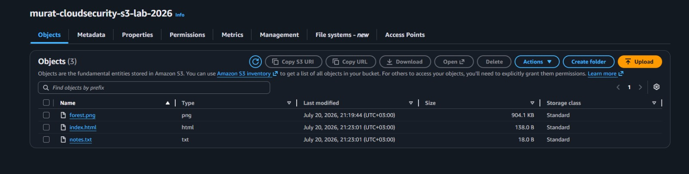
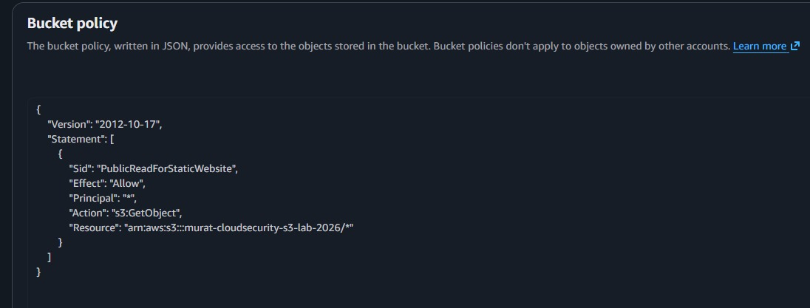
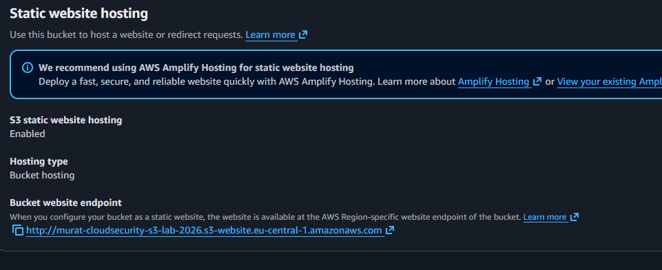
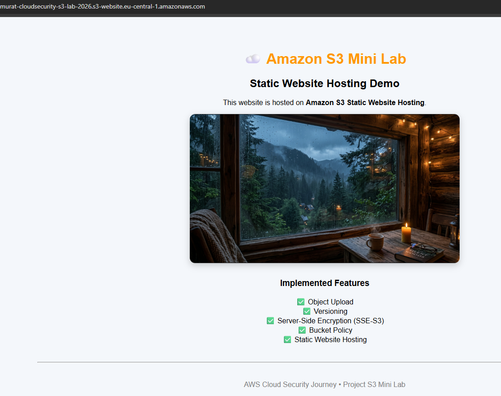

# Amazon S3 Mini Lab

## Overview

This project demonstrates the core features of Amazon S3 by building and configuring a secure storage bucket. During the project, I created an S3 bucket, uploaded objects, enabled versioning, configured server-side encryption (SSE-S3), created a bucket policy, and hosted a simple static website.

The objective of this mini lab was to gain hands-on experience with Amazon S3 while understanding fundamental cloud storage concepts and security best practices.
---

## AWS Service Used

- Amazon S3

---

## Features Implemented

- Amazon S3 bucket creation
- Object upload and management
- Object Versioning
- Server-Side Encryption (SSE-S3)
- Bucket Policy configuration
- Static Website Hosting

## Project Structure

```text
aws-s3-mini-lab/
│
├── README.md
├── website/
│   ├── index.html
│   ├── forest.png
│   └── notes.txt
│
└── screenshots/
    ├── 01-objects-uploaded.png
    ├── 02-version-history.png
    ├── 03-bucket-policy.png
    ├── 04-static-website-hosting.png
    └── 05-live-website.png
```

---

## Screenshots

### Objects Uploaded



Uploaded the website files and a sample text file to the S3 bucket.

---

### Version History



Enabled Versioning and verified that multiple versions of the same object were stored successfully.

---

### Bucket Policy


Configured a bucket policy to allow public read access for static website hosting.

---

### Static Website Hosting



Enabled static website hosting and configured the website endpoint.

---

### Live Website



Successfully hosted a static website using Amazon S3.

---

## What I Learned

During this project, I gained hands-on experience with:

- Amazon S3 bucket creation and management
- Object upload and storage
- Versioning
- Server-Side Encryption (SSE-S3)
- Bucket policies
- Static website hosting
- Basic cloud security best practices
